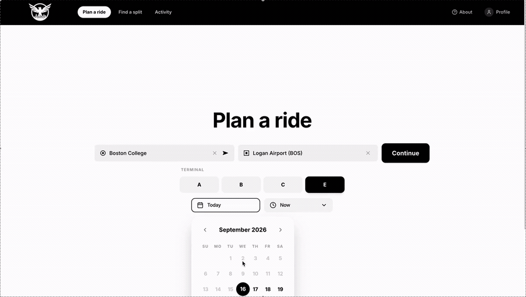

# EagleRide

A campus rideshare coordination platform built for Boston College students to create, discover, join, and coordinate shared rides.

EagleRide combines traffic-aware routing, secure BC-only authentication, concurrency-safe ride operations, and real-time group messaging in a full-stack TypeScript application.

## Demo

<p align="center">
  
</p>

## Features

- **BC-only authentication** — Google OAuth through Supabase with server-side identity validation and exact `@bc.edu` domain enforcement
- **Ride creation & discovery** — create rides, search by origin and destination, filter by date and departure windows, and discover compatible rides across BC campuses
- **Ride coordination** — join and leave rides with persistent participant state and capacity enforcement
- **Traffic-aware routing** — Google Maps routing with shared caching, request deduplication, quota protection, and fallback behavior
- **Real-time group chat** — participant-authorized messaging powered by Server-Sent Events and PostgreSQL `LISTEN/NOTIFY`
- **Message interactions** — persistent reactions, reaction replacement, author-controlled deletion, and real-time synchronization
- **User profiles** — persistent BC identities, display names, and profile avatars
- **Ride lifecycle** — upcoming ride discovery, cancellation handling, activity history, and immediate-departure coordination

## Engineering Highlights

### Concurrency-Safe Ride Operations

Capacity-sensitive ride operations execute transactionally in PostgreSQL. Row-level locking prevents concurrent join requests from overfilling rides or producing inconsistent participant state.

### Event-Driven Real-Time Messaging

Chat events are distributed through PostgreSQL `LISTEN/NOTIFY` and streamed to connected clients using Server-Sent Events (SSE).

```text
PostgreSQL
    │
    │ LISTEN / NOTIFY
    ▼
Node.js / Express
    │
    │ Server-Sent Events
    ▼
React Clients
```

Messages, reactions, and deletions remain persisted in PostgreSQL while connected participants receive updates without refreshing the page.

### Server-Validated Authentication

Google OAuth PKCE is handled through Supabase Auth and validated by the Express server. Authentication tokens are stored in `HttpOnly` cookies rather than browser storage.

Protected requests validate identity server-side, and access is restricted to verified email addresses whose domain exactly matches `bc.edu`.

### Traffic-Aware Routing

EagleRide integrates Google Maps APIs for route and traffic information. Shared caching, request deduplication, quota controls, and fallback behavior reduce unnecessary external requests while keeping route information resilient to upstream failures.

## Architecture

```text
┌─────────────────────────────┐
│      React + TypeScript     │
│            Vite             │
└──────────────┬──────────────┘
               │
          HTTP / SSE
               │
               ▼
┌─────────────────────────────┐
│       Node.js + Express     │
│                             │
│  Auth · Rides · Chat · Maps│
└──────────┬───────────┬──────┘
           │           │
           │           └────────────► Google Maps APIs
           │
           ▼
┌─────────────────────────────┐
│         PostgreSQL          │
│                             │
│ Users · Rides · Participants│
│ Messages · Reactions       │
└──────────────┬──────────────┘
               │
               ▼
         Supabase Auth
```

## Tech Stack

**Frontend:** React, TypeScript, Vite, Tailwind CSS  
**Backend:** Node.js, Express, PostgreSQL  
**Authentication:** Supabase Auth, Google OAuth PKCE  
**APIs:** Google Maps APIs  
**Testing & Infrastructure:** Playwright, Node test runner, GitHub Actions

## Testing

EagleRide includes automated coverage across authentication, PostgreSQL persistence, concurrency-sensitive ride operations, routing, chat, and browser workflows.

```bash
npm run typecheck
npm run build
npm test
npm run test:db
npm run test:ui
```

Database integration tests execute against isolated PostgreSQL databases rather than replacing persistence with an in-memory datastore.

## Local Development

### Requirements

- Node.js 24
- npm 10+
- PostgreSQL

### Setup

```bash
git clone https://github.com/Pafos1k/EagleRide.git
cd EagleRide

npm ci
cp .env.example .env
```

Configure the required environment variables, then:

```bash
npm run build
npm run db:migrate
npm run dev
```

The application runs on `http://localhost:3000` by default.

## Environment

```text
DATABASE_URL
SUPABASE_URL
SUPABASE_PUBLISHABLE_KEY
APP_ORIGIN
```

Google OAuth provider credentials are configured through Supabase and are not stored in frontend code.

Database credentials and authentication secrets must remain server-side and should never be exposed through `VITE_*` environment variables.

## Database Migrations

Schema migrations live in:

```text
server/migrations/
```

Apply pending migrations with:

```bash
npm run build
npm run db:migrate
```

Applied migrations are tracked and checksum-validated. Existing migrations should not be modified after application; schema changes are introduced through new ordered migrations.

## Security

EagleRide maintains several application security boundaries:

- authentication tokens are stored in `HttpOnly`, `SameSite=Lax` cookies
- protected identities are validated server-side
- Google provider tokens are not persisted
- ride ownership is derived from authenticated server identity
- protected mutations enforce same-origin requests
- SQL queries use parameterized values
- ride and chat resources enforce participant authorization
- database credentials remain server-only

## Roadmap

- Rider reliability and post-ride reputation
- Read-only rider profiles with reliability history
- Improved fare estimation
- Production deployment
- Notifications and unread-message state

## Author

**Vladislav Hoila**  
Computer Science @ Boston College

[LinkedIn](https://www.linkedin.com/in/vladislav-hoila-54a04125b) · [GitHub](https://github.com/Pafos1k)
